<p align="center">
  
</p>

<h1 align="center">
  VectorWorld: Efficient Streaming World Model via<br>
  Diffusion Flow on Vector Graphs
</h1>

<p align="center">
  <a href="https://scholar.google.com/citations?user=6gZ8vloAAAAJ"><b>Chaokang Jiang</b></a><sup>1</sup>&nbsp;&nbsp;
  <a href="https://scholar.google.com/citations?user=Ux677B4AAAAJ&hl=en"><b>Desen Zhou</b></a><sup>1</sup>&nbsp;&nbsp;
  <a href="https://scholar.google.com/citations?user=j4YXCukAAAAJ"><b>Jiuming Liu</b></a><sup>2</sup>&nbsp;&nbsp;
  <a href="https://scholar.google.com/citations?user=JZViN_4AAAAJ"><b>Kevin Li Sun</b></a><sup>1</sup>
</p>

<p align="center">
  <sup>1</sup>Bosch XC-CN&nbsp;&nbsp;&nbsp;&nbsp;
  <sup>2</sup>University of Cambridge
</p>

<p align="center">
  
  <a href="https://jiangchaokang.github.io/VectorWorld/">
    
  </a>
  <a href="https://arxiv.org/abs/2603.17652">
    
  </a>
  
  
</p>

<p align="center">
  <b>Streaming vector-graph world model for autonomous-driving simulation.</b><br>
  Warm-started initialization, one-step frontier completion, and kilometer-scale closed-loop rollout.
</p>

<p align="center">
  <a href="https://jiangchaokang.github.io/VectorWorld/">
    
  </a>
</p>

<p align="center">
  <em>For videos, interactive figures, and qualitative examples, please visit the project page.</em>
</p>

---

## Code Availability Notice

**The implementation code and pretrained model artifacts are temporarily unavailable.**

This repository is currently undergoing Bosch's internal open-source approval process. Before public distribution, the source code, model weights, training pipeline, data-processing utilities, and simulation components must be reviewed and formally cleared by the Bosch Open Source Program Office.

This is a compliance-related temporary restriction. The research documentation, project page, visual materials, and citation information remain available.

| Currently available | Pending Bosch OSPO approval |
|:---|:---|
| Project page and research documentation | Model implementation code |
| Public figures and demo materials | Pretrained model weights |
| Paper information and citation | Training and evaluation scripts |
| High-level method description | Data processing and simulation code |

We are working to complete the approval process and will update this repository once public release of the approved materials is authorized.

For academic collaboration or project-related questions, please contact the maintainers. Please note that source code, pretrained weights, and internal artifacts cannot be distributed until the approval process is complete.

---

## Overview

**VectorWorld** is a streaming, fully vectorized world model for closed-loop autonomous-driving simulation. It incrementally generates ego-centric **64 m × 64 m** lane-agent vector-graph tiles during rollout, enabling policies to interact with dynamically extended environments beyond fixed logged scenarios.

The system is designed around three components:

| Component | Purpose |
|:---|:---|
| **Motion-aware interaction-state VAE** | Produces policy-compatible warm-start states for history-conditioned planners. |
| **Edge-gated relational DiT + MeanFlow/JVP** | Performs one-step masked frontier completion on heterogeneous vector graphs. |
| **DeltaSim** | Provides physics-aligned NPC behavior for long-horizon closed-loop rollout. |

Together, these components support real-time vector-world generation, reactive traffic behavior, and kilometer-scale closed-loop simulation.

---

## Highlights

- **Streaming vector-world generation**  
  Raster-free lane-agent graph generation for long-horizon autonomous-driving simulation.

- **Policy-compatible warm start**  
  Motion-aware initialization reduces the mismatch between generated scenes and history-conditioned policies.

- **One-step frontier completion**  
  MeanFlow with JVP-based supervision enables fast masked completion of new map-agent tiles.

- **Reactive closed-loop traffic**  
  DeltaSim maintains physically aligned non-ego agent behavior over extended rollouts.

- **Kilometer-scale rollout**  
  VectorWorld supports stable **1 km+** closed-loop simulation with repeated frontier outpainting.

- **Controllable vector prior**  
  Generated vector scenes can serve as structured priors for downstream surround-view video generation.

---

## Visual Tour

Explore the full set of videos, interactive figures, and qualitative examples on the project page:

<p align="center">
  <a href="https://jiangchaokang.github.io/VectorWorld/">
    
  </a>
</p>

The project page includes:

- system overview and method figures;
- one-step generation efficiency clips;
- closed-loop rollout demonstrations;
- exported vector-scene inspection;
- surround-view video generation examples.

---

## Selected Reported Results

The following numbers summarize representative results reported in the paper and project page.

| Category | Result |
|:---|:---|
| Online generation cost | approximately **5.6 ms** per **64 m × 64 m** tile |
| Closed-loop horizon | **1 km+** rollout |
| Warm-start effect | early-horizon jerk reduced from **16.6** to **9.6** |
| nuPlan endpoint gap | **0.078 m** |
| nuPlan initial collision rate | **3.01%** |
| Waymo perceptual score | FD **0.94** |
| RL training value | PPO success improved from **25.7%** to **56.0%** after retraining in VectorWorld |

Please refer to the arXiv paper for the complete experimental setup and evaluation details.

---

## Paper

**VectorWorld: Efficient Streaming World Model via Diffusion Flow on Vector Graphs**  
Chaokang Jiang, Desen Zhou, Jiuming Liu, Kevin Li Sun  
ICML 2026 (Spotlight) · arXiv:2603.17652

<p align="center">
  <a href="https://arxiv.org/abs/2603.17652">
    
  </a>
</p>

---

## Repository Scope

This public repository is intentionally limited while the compliance review is ongoing.

The current public snapshot may contain:

```text
vectorworld/
├── README.md
├── assets/          # Public figures, icons, and demo media
└── project-page/    # Project-page source and research documentation
```

The following materials are intentionally not part of the temporary public snapshot:

```text
model implementation
training code
data processing scripts
simulation code
evaluation scripts
pretrained checkpoints
internal experiment artifacts
```

Subject to Bosch OSPO approval, the repository may be expanded with approved implementation and reproducibility materials in a future update.

---

## Datasets

The experiments in the paper use autonomous-driving datasets including **Waymo Open Motion Dataset v1.1.0** and **nuPlan**.

No raw dataset files are distributed in this repository. Users should obtain datasets directly from the official providers and follow their respective licenses, access rules, and terms of use.

---

## Acknowledgements

This work builds upon and is inspired by several excellent research and open-source efforts in vectorized scene generation, autonomous-driving simulation, graph learning, and generative modeling.

We especially acknowledge the broader research ecosystem around autonomous-driving datasets, vectorized scene representations, diffusion/flow-based generative models, and closed-loop simulation.

---

## Citation

If you find VectorWorld useful, please consider citing:

<pre>
@inproceedings{jiang2026vectorworld,
  title     = {VectorWorld: Efficient Streaming World Model via Diffusion Flow on Vector Graphs},
  author    = {Jiang, Chaokang and Zhou, Desen and Liu, Jiuming and Sun, Kevin Li},
  booktitle = {Proceedings of the 43rd International Conference on Machine Learning (ICML)},
  year      = {2026},
  note      = {Spotlight},
  url       = {https://arxiv.org/abs/2603.17652},
}
</pre>

---

## License

License information for source code, model weights, and related artifacts will be provided if and when those materials are approved for public release.

Until then, this repository should be treated as a research-documentation repository rather than a runnable code release.
